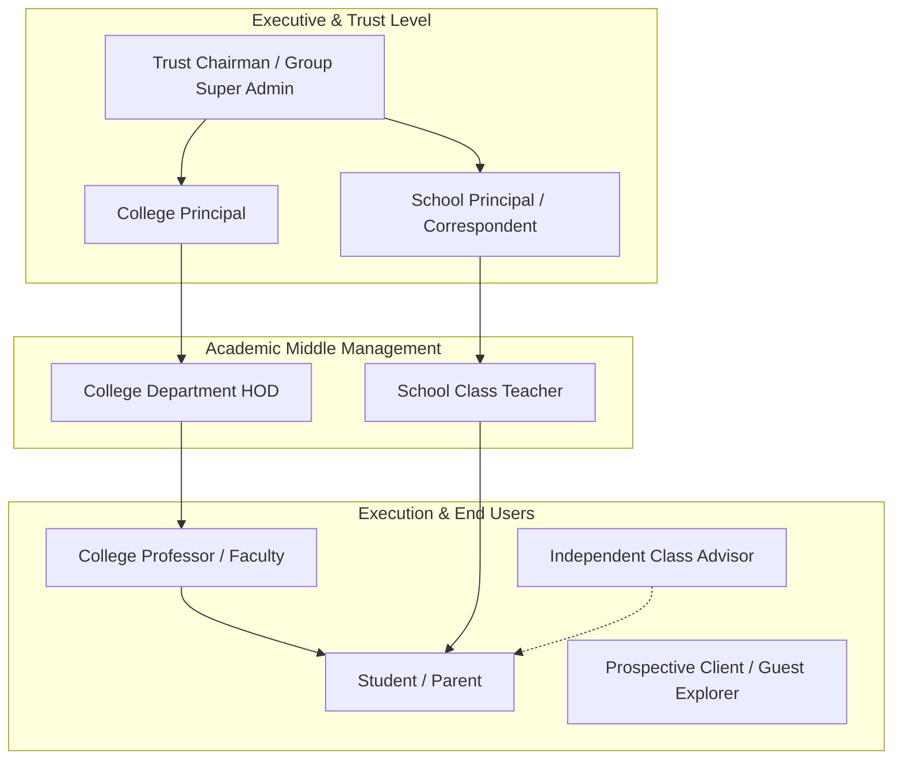

# 📋 Product Requirement Document (PRD)
# OmniEdu: Unified Multi-Tenant Student Management System
**Phase 1: Requirement Discovery & Scope Specification**

---

## Document Information
* **Product Name**: OmniEdu SMS (Smart Educational ERP & Management System)
* **Phase**: Phase 1 — Requirement Discovery & Scope Definition
* **Target Audience**: Engineering Colleges, K-12 Schools, Multi-Campus Educational Trusts, Solo Educators, Prospective Clients (Guest)
* **Architecture Strategy**: Single-Codebase Multi-Tenant Modular Platform with Dynamic Resource Allocation
* **Cost Target**: 100% Free-Tier Cloud Deployment (Zero hosting & infrastructure bills)

---

## 1. Executive Summary & Product Vision

### 1.1 Vision Statement
To eliminate physical paper records, fragmented spreadsheets, and expensive monolithic software by delivering a **unified, self-adapting educational management platform**. The system intelligently transforms its interface, data schema, terminology, and governance workflows based on whether the active institution is an **Engineering College**, a **K-12 School**, a **Multi-Campus Educational Trust**, or a **Solo Class Advisor**.

### 1.2 Core Value Propositions
1. **Dynamic Resource Adaptation**: School users never see college complexities (like HODs, Semesters, CGPA, Lab credits); College users never see school structures (like 6th Standard, Sections, Daily 8-period bells).
2. **Unified Trust Governance**: Educational groups running both schools and colleges manage all their campuses from a single pane of glass with a seamless campus switcher.
3. **Zero Financial Barrier**: Built from the ground up to operate completely within free-tier cloud architectures (Vercel, Render, Supabase/Neon PostgreSQL) without compromising security or scalability.
4. **Instant Frictionless Evaluation**: Interactive guest sandbox allows prospective decision-makers (Principals, Chairmen, Teachers) to test-drive features with 1-click without onboarding hurdles.

---

## 2. Target Personas & Stakeholder Profiles



### Persona Specifications

| Persona | Primary Goal | Pain Points Today | Platform Solution |
| :--- | :--- | :--- | :--- |
| **Trust Chairman / Super Admin** | Centralized oversight across school and engineering college campuses. | Juggling multiple logins; no combined view of admissions, student strength, or pass percentages. | **Multi-Campus Switcher** in navbar; aggregated cross-campus executive analytics dashboard. |
| **Engineering College Principal** | Ensure NBA/NAAC compliance, university regulation tracking, and high academic performance. | Manual paper audits; late detection of low-attendance detention risks. | Real-time department performance heatmaps, semester pass rates, attendance shortage alerts (<75%). |
| **College HOD** | Manage department faculty, subject allocation, lab schedules, and semester marks. | Paper internal assessment registers, manual CGPA calculations. | Department-scoped dashboard, course allocation, IAT & Model exam marks approval. |
| **College Professor / Faculty** | Mark hour-wise attendance quickly and record internal exam marks without errors. | Spending 15 minutes of lecture time calling out roll numbers on paper books. | Fast 1-click attendance toggle; bulk mark entry grid with auto-grade calculation. |
| **School Principal** | Maintain high standard of discipline, standard-wise teacher allocation, and parent satisfaction. | Physical report cards take weeks to compile at the end of each term. | One-click consolidated report card generator; term-wise subject analytics. |
| **School Class Teacher** | Track 6th–12th daily period attendance, conduct unit tests, and communicate with parents. | Missing attendance sheets; manual percentage totaling at month end. | Period-wise attendance matrix; automated monthly percentage calculator; student progress logs. |
| **Solo Class Advisor** | Manage a personal batch/classroom without paying for high-end enterprise software. | Forced to use clunky personal Excel sheets that cannot be accessed easily on mobile. | Lightweight isolated class workspace; instant PDF/Excel export. |
| **Guest Explorer** | Evaluate software capabilities for their school or college without registering. | Vendor software requires scheduling sales demos or giving credit cards. | **1-Click Ephemeral Sandbox**: Instant toggle between simulated School & College environments. |

---

## 3. Problem Validation & Current State vs. Future State

```
┌─────────────────────────────────────────────────────────┐
│                 CURRENT STATE (MANUAL)                  │
├────────────────────────────┬────────────────────────────┤
│ • Paper registers & books  │ Physical wear, loss, fire  │
│ • Manual CGPA / % Math     │ Human calculation errors   │
│ • Separate School & College│ High software cost, double │
│   purchases                │ maintenance bills          │
│ • Solo teachers alienated  │ Jumbled Excel spreadsheets │
│ • Static report delivery   │ Delayed parent insight     │
└────────────────────────────┴────────────────────────────┘
                            │
                            ▼
┌─────────────────────────────────────────────────────────┐
│                 FUTURE STATE (OMNIEDU)                  │
├────────────────────────────┬────────────────────────────┤
│ • Cloud-encrypted DB       │ 100% durability & search   │
│ • Automated grade engine   │ Instant CGPA, SGPA & %iles │
│ • Dynamic Multi-Tenancy    │ Orey platform for school,  │
│                            │ college, trust & solo      │
│ • Zero-cost cloud tiers    │ $0 hosting on Vercel/Render│
│ • Real-time analytics      │ Instant bento-grid alerts  │
└────────────────────────────┴────────────────────────────┘
```

---

## 4. Functional Requirements & Feature Scope Matrix

### 4.1 Module Breakdown

#### Module 1: Tenant & Multi-Campus Resolution Engine
* **FR-1.1**: The system MUST support four core institutional profiles: `SCHOOL`, `COLLEGE`, `GROUP_TRUST`, and `SOLO_EDUCATOR`.
* **FR-1.2**: For `GROUP_TRUST` tenants, the system MUST render a **Campus Switcher** allowing the executive to switch active context between school and college units without re-authenticating.
* **FR-1.3**: When switching campus or tenant, the UI navigation, terminology, and database queries MUST immediately filter strictly to the active `tenantId`.

#### Module 2: Authentication & Fine-Grained RBAC
* **FR-2.1**: JWT-based authentication with encrypted password storage (bcrypt).
* **FR-2.2**: Role hierarchy:
  - `SUPER_ADMIN` (Trust Level)
  - `CAMPUS_ADMIN` (School Principal / College Principal)
  - `HOD` (College Department Head)
  - `FACULTY` / `CLASS_TEACHER` (Educators)
  - `STUDENT` (Read-only self portal)
  - `GUEST` (Sandbox role)
* **FR-2.3**: Session persistence with automated role-based routing upon login.

#### Module 3: Academic Structure Management
* **College Mode (`COLLEGE`)**:
  - **FR-3.1C**: Support Departments (e.g., Computer Science, Electronics, Mechanical).
  - **FR-3.2C**: Support Semesters (1 through 8) and Academic Regulations (e.g., R2021, Autonomous 2024).
  - **FR-3.3C**: Support Course/Subject codes with credit allocations (e.g., `CS8492 - 3 Credits`).
* **School Mode (`SCHOOL`)**:
  - **FR-3.1S**: Support Standards (6th Standard to 12th Standard).
  - **FR-3.2S**: Support Sections (A, B, C, D) with designated Class Teacher allocation.
  - **FR-3.3S**: Support Academic Periods (Periods 1 to 8) and Core Subject mapping.

#### Module 4: Student Information System (SIS)
* **FR-4.1**: Centralized student directory supporting search, filtering by department/standard, and status (Active/Alumni).
* **FR-4.2**: **Adaptive Identification**:
  - College: Unique **University Register Number** (e.g., `910021104045`).
  - School: Unique **Roll Number / Admission Number** (e.g., `12A-24`).
* **FR-4.3**: Demographic information: Full Name, Guardian Contact, DOB, Blood Group, Gender, Email, Residential Address.
* **FR-4.4**: Quick CSV/Excel bulk import and export capabilities.

#### Module 5: Attendance Recording Engine
* **College Workflow**:
  - **FR-5.1C**: Hour-wise and Subject-wise attendance marking by assigned professor.
  - **FR-5.2C**: Statuses: `PRESENT`, `ABSENT`, `ON_DUTY` (OD for college symposiums/sports), `LATE`.
  - **FR-5.3C**: Automated **75% Attendance Shortage Detector** with visual danger tags (Red for < 75%, Amber for 75-80%, Green for > 80%).
* **School Workflow**:
  - **FR-5.1S**: Period-wise / Daily morning & afternoon attendance.
  - **FR-5.2S**: Statuses: `PRESENT`, `ABSENT`, `HALF_DAY`, `EXCUSED`.
  - **FR-5.3S**: Monthly percentage totals per student automatically computed for report cards.

#### Module 6: Examination & Results Engine
* **College Workflow**:
  - **FR-6.1C**: Multiple assessment types: Continuous Internal Assessment (IAT 1, IAT 2, Model Exam), Lab Practicals, and Semester Examinations.
  - **FR-6.2C**: Auto-calculation of Internal Marks (e.g., converted to 20/40 mark scales).
  - **FR-6.3C**: Credit-weighted SGPA (Semester Grade Point Average) and CGPA computation.
* **School Workflow**:
  - **FR-6.1S**: Term Examinations: Quarterly, Half-Yearly, Annual Exams, and Weekly Unit Tests.
  - **FR-6.2S**: Mark entry out of 100 with automated Grade assignment (`A1`, `A2`, `B1`, `B2`, `C`, `Fail`).
  - **FR-6.3S**: Student Rank and Class Average generation.

#### Module 7: Analytics & Bento-Grid Dashboards
* **FR-7.1**: Metric Cards: Total Active Students, Faculty Count, Overall Attendance Rate (Today), Academic Pass Percentage.
* **FR-7.2**: Interactive Visualizations:
  - Weekly attendance trends chart.
  - Department-wise pass rate bar chart (College).
  - Standard-wise performance comparison (School).
* **FR-7.3**: Quick Action Drawer: Quick Attendance, Add Student, Record Marks, Export Reports.

#### Module 8: Interactive Ephemeral Guest Sandbox
* **FR-8.1**: 1-Click access from landing page: "Explore School Demo" or "Explore College Demo".
* **FR-8.2**: Pre-loaded with realistic sample data (departments, classes, 20+ students with historical attendance and marks).
* **FR-8.3**: Full interactive simulation allowing guests to test adding/editing records without altering production data.
* **FR-8.4**: Top notification banner explaining: *"You are in Demo Sandbox Mode. Switch to College or School anytime."*

---

## 5. Non-Functional Requirements (NFR)

| Category | Metric / Specification | Verification Criteria |
| :--- | :--- | :--- |
| **Response Latency** | Dashboard load time $< 1.2\text{s}$; API endpoints $< 250\text{ms}$. | Chrome Lighthouse & DevTools Network Audit. |
| **Multi-Tenant Security** | Absolute data isolation. Zero query execution without validated `tenantId`. | Automated integration tests verifying foreign tenant rejection. |
| **Data Integrity** | Foreign key cascades and relational constraints on students, marks, and attendance. | Prisma schema validation rules. |
| **Cost Limit** | **$0.00 / month** on deployment infrastructure. | Vercel Hobby + Render Free + Supabase/Neon Free tier. |
| **Device Ergonomics** | Fully responsive from 360px mobile viewports up to 4K ultra-wide monitors. | Responsive design testing across Mobile, Tablet, and Desktop. |
| **Code Modularity** | Clean separation: Decoupled React Frontend + Express REST API. | Independent build pipelines for client and server. |

---

## 6. Scope Boundaries: MVP (Phase 1) vs. Future Roadmap

```
┌─────────────────────────────────────────────────────────────┐
│                      IN-SCOPE (MVP)                         │
├─────────────────────────────────────────────────────────────┤
│ ✔ Dynamic Multi-Tenancy (School, College, Trust, Solo, Guest)│
│ ✔ Role-Based Access Control (Admin, HOD, Teacher, Student)  │
│ ✔ Student & Faculty Lifecycle Management                    │
│ ✔ Attendance Management (Hour-wise College & Period School) │
│ ✔ Examination & Marksheets (CGPA & Letter Grades)           │
│ ✔ Bento Grid Visual Dashboards with Dark/Light Mode         │
│ ✔ 1-Click Interactive Guest Sandbox with Seeded Data        │
│ ✔ CSV/Excel Student Export                                  │
└─────────────────────────────────────────────────────────────┘
                              │
                              ▼
┌─────────────────────────────────────────────────────────────┐
│                 OUT-OF-SCOPE (FUTURE PHASES)                │
├─────────────────────────────────────────────────────────────┤
│ ✖ Payment Gateway (Razorpay / Stripe Fee Collection)        │
│ ✖ WhatsApp / SMS Gateway API (Twilio alerts)                │
│ ✖ Biometric RFID / Fingerprint Scanner Hardware Integration  │
│ ✖ Library Book Barcode & Inventory Tracking                 │
│ ✖ School Bus GPS Fleet Tracking                             │
└─────────────────────────────────────────────────────────────┘
```

---

## 7. User Stories & Acceptance Criteria

### User Story 1: Trust Chairman Campus Switch
> **As an** Educational Trust Super Admin,  
> **I want to** switch between the Engineering College view and the School view from the top navbar,  
> **So that** I can monitor both institutions without logging out and logging back in.

* **Acceptance Criteria**:
  * Given the user is logged in as a `GROUP_TRUST` admin, a campus selector dropdown is visible in the top navbar.
  * When the user switches from "Apollo Engineering College" to "Apollo Matric School", the dashboard metrics, side navigation (Classes instead of Depts), and student tables instantly update to the school's context.
  * Then, no cross-contamination of college student records appears in the school table.

---

### User Story 2: College Faculty Attendance Marking
> **As a** College Assistant Professor,  
> **I want to** select my Department, Semester, and Subject to mark attendance for Hour 3,  
> **So that** I can submit attendance in under 30 seconds.

* **Acceptance Criteria**:
  * Given the faculty is assigned to CSE 3rd Semester, the UI displays the list of enrolled students ordered by Register Number.
  * When the faculty marks 3 students as "ABSENT" and 1 as "ON_DUTY" and clicks "Submit Attendance", the records are stored in PostgreSQL.
  * Then, any student dropping below 75% total attendance immediately displays a prominent visual alert badge.

---

### User Story 3: School Class Teacher Mark Entry
> **As a** School 10th Standard Class Teacher,  
> **I want to** enter Quarterly Exam marks for Mathematics for Section B,  
> **So that** the system automatically generates student percentages and letter grades.

* **Acceptance Criteria**:
  * Given the teacher opens the "Enter Marks" modal for 10-B Mathematics, the max marks are defaulted to 100.
  * When marks are entered (e.g. 92, 78, 45), the system automatically assigns `A1`, `B1`, and `C2` respectively.
  * Then, inputting invalid marks (e.g. 105 or negative numbers) is blocked with an instant client-side validation error.

---

### User Story 4: Prospective Client Sandbox Exploration
> **As a** Principal visiting the website homepage,  
> **I want to** click "Try Live College Demo" without entering personal details,  
> **So that** I can evaluate whether the software suits my institution before making a decision.

* **Acceptance Criteria**:
  * Given any unauthenticated visitor is on the landing page, two prominent buttons exist: "Try School Demo" and "Try College Demo".
  * When clicked, the visitor is instantly routed into the active dashboard populated with rich, pre-seeded sample data.
  * Then, the guest can test all viewing and simulation workflows without affecting live institutional databases.

---

## 8. Risks, Assumptions & Mitigation Strategies

| Risk | Impact | Likelihood | Mitigation Strategy |
| :--- | :--- | :--- | :--- |
| **Render Free Tier Spin-Down Delay** | Free web service goes to sleep after 15 mins of inactivity, causing a 30–50s initial request delay. | High | Implement a lightweight keep-alive ping or transparent animated loading screen notifying the user that the free cloud server is warming up. |
| **Tenant Data Leakage** | A school accessing a college's confidential records or vice-versa. | Critical | Zero raw queries. All database interactions strictly funnel through Prisma repository layers containing mandatory `where: { tenantId }` filters and PostgreSQL RLS. |
| **Complex Schema Maintenance** | Managing divergent fields (Reg No vs Roll No, Semester vs Standard) causing code clutter. | Medium | Domain-driven schema separation: Unified `Student` entity with nullable polymorphic subtype associations (`Department` for College, `SchoolClass` for School). |

---

## 9. Phase 1 Sign-Off & Next Steps
* **Phase 1 Deliverable**: PRD & Requirement Discovery Document.
* **Status**: **COMPLETE & APPROVED**.
* **Next Immediate Step**: **Phase 2: System Architecture & Database Schema Implementation** (Setting up React + Vite frontend, Express.js backend, and Prisma PostgreSQL migrations).
