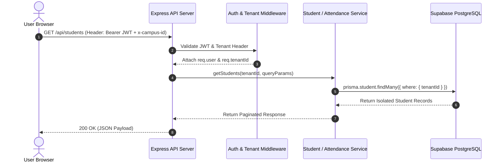
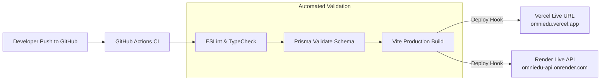

# 🏛️ Phase 2: System Design & Tech Stack Architecture
# OmniEdu: Unified Multi-Tenant Student Management System

---

## Document Control
* **Product Name**: OmniEdu SMS
* **Phase**: Phase 2 — System Design, Technical Specification & Tech Stack Architecture
* **Status**: Complete & Ready for Implementation (Phase 3)
* **Hosting Cost Budget**: **$0.00 / month** (100% Free-Tier Cloud Architecture)
* **Author / Architect**: Antigravity System Architecture Engine

---

## 1. Architectural Principles & High-Level System Topology

### 1.1 Core Architectural Principles
1. **Multi-Tenant Data Isolation by Design**: Single shared PostgreSQL database where every query is strictly partitioned by `tenantId` using Application-Level Context and PostgreSQL Row-Level Security (RLS). Zero data cross-contamination.
2. **Dynamic Resource Adaptation Engine**: Polymorphic domain models and modular front-end component registries that adapt terminology, forms, and tables on the fly depending on `tenantType` (`COLLEGE`, `SCHOOL`, `GROUP_TRUST`, `SOLO_EDUCATOR`, or `DEMO_SANDBOX`).
3. **Decoupled Client-Server Monorepo**: Independent React 19 Frontend and Node.js Express Backend maintaining distinct build pipelines, unified by TypeScript shared types.
4. **Zero-Cost Cloud Topology**: Engineered to deploy seamlessly on high-uptime free tiers: **Vercel** for the client edge, **Render** for the API runtime, and **Supabase / Neon** for serverless PostgreSQL.

---

### 1.2 End-to-End System Topology Diagram

```mermaid
graph TD
    ClientBrowser["Client Web Browser<br/>(Chrome / Safari / Firefox / Mobile)"]
    
    subgraph EdgeCDN ["Edge & Presentation Layer (Vercel Free Tier)"]
        VercelCDN["Vercel Edge Network<br/>(HTTPS / Gzip / Brotli)"]
        ReactApp["React 19 + Vite SPA<br/>(Tailwind CSS + Zustand + TanStack Query)"]
    end
    
    subgraph ComputeLayer ["Compute & API Gateway (Render Free Tier)"]
        RenderService["Render Web Service<br/>(Node.js 20 LTS + Express.js API)"]
        
        subgraph MiddlewarePipeline ["Express Middleware Pipeline"]
            CorsHelmet["CORS Whitelist & Helmet Security"]
            RateLimit["Sliding Window Rate Limiter"]
            JWTAuth["JWT Verification & Role Extractor"]
            TenantContext["Tenant Context Resolver & Validator"]
        end
        
        subgraph LayeredArchitecture ["Layered Hexagonal Architecture"]
            Controllers["HTTP Controllers (Zod Validation)"]
            ServiceLayer["Core Domain Services (Business Logic)"]
            RepoLayer["Prisma Repositories (Tenant Scoped)"]
        end
    end
    
    subgraph DataStorage ["Persistence Layer (Supabase / Neon Free Tier)"]
        PostgreSQL["Serverless PostgreSQL 16<br/>(Row-Level Security + Relational Indexes)"]
        PrismaEngine["Prisma Client ORM Engine"]
    end

    ClientBrowser -->|HTTPS Requests| VercelCDN
    VercelCDN --> ReactApp
    ReactApp -->|REST API Calls (Bearer JWT)| RenderService
    
    RenderService --> CorsHelmet
    CorsHelmet --> RateLimit
    RateLimit --> JWTAuth
    JWTAuth --> TenantContext
    TenantContext --> Controllers
    Controllers --> ServiceLayer
    ServiceLayer --> RepoLayer
    RepoLayer --> PrismaEngine
    PrismaEngine -->|Connection Pooling| PostgreSQL
```

---

## 2. Technology Stack Selection & Cost Breakdown

| Architectural Layer | Technology Selected | Version / Tier | Cost / Month | Rationale & Architectural Capabilities |
| :--- | :--- | :--- | :--- | :--- |
| **Frontend Framework** | **React + Vite** | React 19, Vite 5.x | **$0.00** | Blazing fast build speeds (ESBuild), single-page app responsiveness, small bundle footprints. |
| **Styling & Design System** | **Tailwind CSS + Radix UI + Lucide Icons** | Tailwind v3.4+ | **$0.00** | Complete styling flexibility, dark/light theme switching, accessible primitives, zero CSS bloat. |
| **Client State & Cache** | **Zustand + TanStack Query v5** | Latest | **$0.00** | Clean separation: Zustand for auth/active campus state; TanStack Query for server cache, auto-refetch, and optimistic UI updates. |
| **Backend API Engine** | **Express.js (Node.js)** | Node 20 LTS, Express 4.19+ | **$0.00** | Lightweight, rock-solid stability, mature ecosystem, rapid middleware integration. |
| **API Validation** | **Zod** | v3.23+ | **$0.00** | Runtime schema validation for all HTTP payloads, preventing malformed inputs and SQL/NoSQL injections. |
| **Database & ORM** | **PostgreSQL + Prisma ORM** | PG 16, Prisma 5.x | **$0.00** | Strict relational foreign keys (Depts $\rightarrow$ Semesters $\rightarrow$ Students $\rightarrow$ Marks), type-safe query generation. |
| **Frontend Hosting** | **Vercel** | Hobby Plan | **$0.00** | Free global CDN, automatic SSL certificates, zero-config deployment from GitHub. |
| **Backend Hosting** | **Render** | Free Web Service | **$0.00** | Free 512MB RAM Linux container, auto-deploy on git push, free TLS termination. |
| **Cloud Database** | **Supabase / Neon** | Free Tier (500MB) | **$0.00** | Generous 500MB storage, connection pooling (PgBouncer), automatic point-in-time recovery, RLS native support. |
| **Cloud File Storage** | **Supabase Storage** | Free Tier (1GB) | **$0.00** | S3-compatible bucket for student profile photos, syllabus PDFs, and CSV import templates. |
| **TOTAL RUNTIME COST** | | | **$0.00 / month** | **100% Free-Tier Architecture Guaranteed.** |

---

## 3. Database Schema Design (Production Prisma Specification)

The database schema is engineered with a **Polymorphic Multi-Tenant Domain Pattern**. It houses common educational entities (`Tenant`, `User`, `Student`, `Attendance`, `MarkRecord`) while cleanly isolating institution-specific relational subtypes (`Department`, `Course` for College; `SchoolClass` for School).

```prisma
// datasource and generator definition
datasource db {
  provider = "postgresql"
  url      = env("DATABASE_URL")
}

generator client {
  provider = "prisma-client-js"
}

// -------------------------------------------------------------
// ENUMS
// -------------------------------------------------------------

enum TenantType {
  COLLEGE         // Engineering & Arts Colleges
  SCHOOL          // K-12 Schools (6th to 12th)
  GROUP_TRUST     // Conglomerate managing multiple campuses
  SOLO_EDUCATOR   // Standalone Class Advisor / Tutor
  DEMO_SANDBOX    // Ephemeral Guest Playground
}

enum Role {
  SUPER_ADMIN     // Trust Executive / Chairman
  CAMPUS_ADMIN    // College Principal / School Principal
  HOD             // College Department Head
  FACULTY         // College Professor / Lecturer
  CLASS_TEACHER   // School Section Teacher
  CLASS_ADVISOR   // College Batch Mentor
  STUDENT         // Student / Parent Portal
  GUEST           // Demo Explorer
}

enum AttendanceStatus {
  PRESENT
  ABSENT
  ON_DUTY         // Official college duty / sports / symposiums
  LATE
  HALF_DAY        // School half day
}

enum ExamType {
  // College Exam Types
  IAT_1           // Internal Assessment Test 1
  IAT_2           // Internal Assessment Test 2
  MODEL_EXAM      // Pre-semester Model Exam
  SEMESTER_FINAL  // University Semester Exam
  LAB_INTERNAL    // Practical Assessment
  
  // School Exam Types
  UNIT_TEST
  QUARTERLY
  HALF_YEARLY
  ANNUAL
}

// -------------------------------------------------------------
// TENANCY & INSTITUTIONAL HIERARCHY
// -------------------------------------------------------------

model Tenant {
  id            String         @id @default(uuid())
  name          String         // e.g. "Apollo Engineering College"
  code          String         @unique // e.g. "APOLLO-ENG"
  type          TenantType     @default(COLLEGE)
  logoUrl       String?
  address       String?
  phone         String?
  email         String?
  
  // Hierarchical Self-Relation (Trust Group -> Campuses)
  parentId      String?
  parent        Tenant?        @relation("GroupCampuses", fields: [parentId], references: [id], onDelete: SetNull)
  campuses      Tenant[]       @relation("GroupCampuses")
  
  // Direct Associated Entities
  users         User[]
  departments   Department[]
  classes       SchoolClass[]
  students      Student[]
  courses       Course[]
  exams         Exam[]
  attendances   Attendance[]
  marks         MarkRecord[]
  
  createdAt     DateTime       @default(now())
  updatedAt     DateTime       @updatedAt

  @@index([type])
  @@index([parentId])
}

// -------------------------------------------------------------
// USER & IDENTITY MANAGEMENT
// -------------------------------------------------------------

model User {
  id            String         @id @default(uuid())
  tenantId      String
  tenant        Tenant         @relation(fields: [tenantId], references: [id], onDelete: Cascade)
  
  email         String         @unique
  passwordHash  String
  fullName      String
  role          Role           @default(FACULTY)
  phone         String?
  avatarUrl     String?
  isActive      Boolean        @default(true)
  
  // Optional Academic Linkages
  deptId        String?
  department    Department?    @relation(fields: [deptId], references: [id], onDelete: SetNull)
  
  createdAt     DateTime       @default(now())
  updatedAt     DateTime       @updatedAt

  @@index([tenantId, role])
}

// -------------------------------------------------------------
// COLLEGE SPECIFIC: DEPARTMENTS & COURSES
// -------------------------------------------------------------

model Department {
  id            String         @id @default(uuid())
  tenantId      String
  tenant        Tenant         @relation(fields: [tenantId], references: [id], onDelete: Cascade)
  
  name          String         // e.g., "Computer Science & Engineering"
  code          String         // e.g., "CSE"
  hodName       String?
  
  users         User[]
  students      Student[]
  courses       Course[]
  
  createdAt     DateTime       @default(now())
  updatedAt     DateTime       @updatedAt

  @@unique([tenantId, code])
  @@index([tenantId])
}

model Course {
  id            String         @id @default(uuid())
  tenantId      String
  tenant        Tenant         @relation(fields: [tenantId], references: [id], onDelete: Cascade)
  
  deptId        String?
  department    Department?    @relation(fields: [deptId], references: [id], onDelete: Cascade)
  
  courseCode    String         // e.g., "CS8492"
  title         String         // e.g., "Database Management Systems"
  semester      Int            // 1 to 8
  credits       Int            @default(3)
  isLab         Boolean        @default(false)
  
  attendances   Attendance[]
  marks         MarkRecord[]
  
  createdAt     DateTime       @default(now())

  @@unique([tenantId, courseCode])
  @@index([tenantId, semester])
}

// -------------------------------------------------------------
// SCHOOL SPECIFIC: CLASSES & SECTIONS
// -------------------------------------------------------------

model SchoolClass {
  id            String         @id @default(uuid())
  tenantId      String
  tenant        Tenant         @relation(fields: [tenantId], references: [id], onDelete: Cascade)
  
  standard      Int            // 6 to 12
  section       String         // "A", "B", "C"
  classTeacher  String?        // Name or Faculty ID
  
  students      Student[]
  
  createdAt     DateTime       @default(now())
  updatedAt     DateTime       @updatedAt

  @@unique([tenantId, standard, section])
  @@index([tenantId])
}

// -------------------------------------------------------------
// UNIFIED STUDENT ENTITY (POLYMORPHIC ADAPTATION)
// -------------------------------------------------------------

model Student {
  id            String         @id @default(uuid())
  tenantId      String
  tenant        Tenant         @relation(fields: [tenantId], references: [id], onDelete: Cascade)
  
  fullName      String
  gender        String         // "MALE", "FEMALE", "OTHER"
  dob           DateTime?
  email         String?
  phone         String?
  guardianName  String?
  guardianPhone String?
  address       String?
  photoUrl      String?      // Supabase Storage public avatar URL
  batchYear     String?      // e.g. "2023-2027" (College) or "2025-2026" (School)
  isActive      Boolean        @default(true)
  
  // --- COLLEGE FIELDS (Null if School) ---
  regNumber     String?        // e.g., "910021104045"
  deptId        String?
  department    Department?    @relation(fields: [deptId], references: [id], onDelete: SetNull)
  semester      Int?           // 1 to 8
  regulationYear String?       // e.g. "2021"
  
  // --- SCHOOL FIELDS (Null if College) ---
  rollNumber    String?        // e.g., "12A-18"
  classId       String?
  schoolClass   SchoolClass?   @relation(fields: [classId], references: [id], onDelete: SetNull)
  
  // Historical Records
  attendances   Attendance[]
  marks         MarkRecord[]
  
  createdAt     DateTime       @default(now())
  updatedAt     DateTime       @updatedAt

  @@unique([tenantId, regNumber])
  @@unique([tenantId, rollNumber])
  @@index([tenantId, deptId, semester])
  @@index([tenantId, classId])
}

// -------------------------------------------------------------
// ATTENDANCE ENGINE (HOUR-WISE & PERIOD-WISE)
// -------------------------------------------------------------

model Attendance {
  id            String           @id @default(uuid())
  tenantId      String
  tenant        Tenant           @relation(fields: [tenantId], references: [id], onDelete: Cascade)
  
  studentId     String
  student       Student          @relation(fields: [studentId], references: [id], onDelete: Cascade)
  
  date          DateTime         @db.Date
  status        AttendanceStatus @default(PRESENT)
  
  // Dynamic Context Fields
  hour          Int?             // College: 1 to 8
  period        Int?             // School: 1 to 8
  courseId      String?          // College Subject Link
  course        Course?          @relation(fields: [courseId], references: [id], onDelete: SetNull)
  remarks       String?
  
  createdAt     DateTime         @default(now())

  @@unique([tenantId, studentId, date, hour, courseId])
  @@unique([tenantId, studentId, date, period])
  @@index([tenantId, date])
  @@index([studentId, status])
}

// -------------------------------------------------------------
// EXAMINATION & MARKS ENGINE
// -------------------------------------------------------------

model Exam {
  id            String         @id @default(uuid())
  tenantId      String
  tenant        Tenant         @relation(fields: [tenantId], references: [id], onDelete: Cascade)
  
  title         String         // e.g. "Internal Assessment Test 1" or "Quarterly Exam 2026"
  type          ExamType
  academicYear  String         // e.g. "2025-2026"
  semester      Int?           // College specific (1-8)
  standard      Int?           // School specific (6-12)
  startDate     DateTime?
  
  marks         MarkRecord[]
  
  createdAt     DateTime       @default(now())

  @@index([tenantId, type, academicYear])
}

model MarkRecord {
  id            String         @id @default(uuid())
  tenantId      String
  tenant        Tenant         @relation(fields: [tenantId], references: [id], onDelete: Cascade)
  
  examId        String
  exam          Exam           @relation(fields: [examId], references: [id], onDelete: Cascade)
  
  studentId     String
  student       Student        @relation(fields: [studentId], references: [id], onDelete: Cascade)
  
  // Subject Reference
  courseId      String?        // College Course Link
  course        Course?        @relation(fields: [courseId], references: [id], onDelete: SetNull)
  subjectName   String         // Unified title (e.g. "Mathematics" or "DBMS")
  
  // Continuous Assessment Splits (Anna Univ R2021: 40 CIA + 60 External)
  internalMarks Float?         // e.g. 36 / 40
  externalMarks Float?         // e.g. 52 / 60
  marksObtained Float          // Total combined marks
  maxMarks      Float          @default(100)
  grade         String?        // "O", "A+", "A", "B", "RA" (Re-Appear), "SA" (Shortage of Attendance)
  gradePoints   Float?         // 10.0 scale for CGPA
  creditsEarned Int?           // For CGPA calculation
  isPassed      Boolean        @default(true)
  
  createdAt     DateTime       @default(now())
  updatedAt     DateTime       @updatedAt

  @@unique([tenantId, examId, studentId, subjectName])
  @@index([studentId])
  @@index([tenantId, examId])
}

// -------------------------------------------------------------
// TIMETABLE & PERIOD SCHEDULING
// -------------------------------------------------------------

model TimetableEntry {
  id            String         @id @default(uuid())
  tenantId      String
  tenant        Tenant         @relation(fields: [tenantId], references: [id], onDelete: Cascade)
  
  dayOfWeek     Int            // 1 (Monday) to 6 (Saturday)
  slotNumber    Int            // Hour 1-8 (College) or Period 1-8 (School)
  startTime     String         // "09:00"
  endTime       String         // "09:50"
  
  // College Scoped
  deptId        String?
  semester      Int?
  courseId      String?
  course        Course?        @relation(fields: [courseId], references: [id], onDelete: SetNull)
  
  // School Scoped
  classId       String?
  schoolClass   SchoolClass?   @relation(fields: [classId], references: [id], onDelete: SetNull)
  subjectName   String         // e.g. "Physics" or "Computer Science"
  
  facultyName   String?        // Designated teacher / professor
  roomNumber    String?        // e.g. "LH-204" or "Lab-3"
  
  createdAt     DateTime       @default(now())

  @@index([tenantId, dayOfWeek, slotNumber])
}
```

---

## 4. Backend Architecture & API Contract Specification

### 4.1 Backend Architecture Pattern (Layered Ports & Adapters)
```
server/
├── src/
│   ├── config/              # Environment & DB connection
│   │   ├── env.ts
│   │   └── prisma.ts
│   ├── middleware/          # Security & context pipeline
│   │   ├── auth.middleware.ts
│   │   ├── tenant.middleware.ts
│   │   ├── rateLimiter.middleware.ts
│   │   └── error.middleware.ts
│   ├── modules/             # Domain Feature Modules
│   │   ├── auth/
│   │   │   ├── auth.controller.ts
│   │   │   ├── auth.service.ts
│   │   │   └── auth.schema.ts
│   │   ├── tenants/
│   │   ├── students/
│   │   ├── attendance/
│   │   ├── exams/
│   │   └── analytics/
│   ├── utils/               # CGPA calculator, report card generator
│   │   ├── gradeCalculator.ts
│   │   └── apiResponse.ts
│   └── app.ts               # Express configuration
└── index.ts                 # Server entrypoint & port listener
```

---

### 4.2 Security & Authentication Flow
1. **Dual JWT Strategy**:
   * **Access Token**: 15 minutes validity, signed with RS256/HS256. Payload contains `{ userId, tenantId, role, tenantType, campusIds }`.
   * **Refresh Token**: 7 days validity, stored in HTTP-Only, Secure, SameSite Cookie.
2. **Tenant Context Interceptor**:
   * Every incoming request verifies the JWT.
   * `tenant.middleware.ts` extracts `tenantId`. If the user is a `GROUP_TRUST` admin and provides an `x-campus-id` header, the context shifts safely to that specific sub-campus.
   * Every query injected into Prisma automatically appends `{ where: { tenantId } }`.



---

### 4.3 Core REST API Endpoints Specification

#### 🔐 Authentication & Session
* `POST /api/auth/login`: Email/password authentication, returns `{ accessToken, user, tenant }`.
* `POST /api/auth/demo-login`: Instant 1-click access into simulated `SCHOOL` or `COLLEGE` sandbox mode.
* `POST /api/auth/switch-campus`: For Trust Admins, switches active sub-campus token payload.
* `GET /api/auth/me`: Validates session and returns profile data.

#### 👥 Student Information System
* `GET /api/students`: List students with dynamic query filters (`deptId`, `semester`, `standard`, `search`).
* `POST /api/students`: Create new student (enforces unique `regNumber` for college or `rollNumber` for school).
* `GET /api/students/:id`: Retrieve detailed student dossier (profile, attendance %, CGPA/term marks).
* `PUT /api/students/:id`: Update student information.
* `POST /api/students/bulk-import`: CSV upload for bulk student registration.

#### ⏱️ Attendance Engine
* `POST /api/attendance/mark-batch`: Submit attendance for an entire class/hour in one atomic transaction.
  * Payload: `{ date, hour/period, courseId, records: [{ studentId, status }] }`.
* `GET /api/attendance/report`: Get monthly or semester attendance matrix with percentage calculations.
* `GET /api/attendance/defaulters`: Returns all students with $< 75\%$ attendance for instant warning generation.

#### 📝 Examination & Results
* `POST /api/exams`: Create an examination schedule (IAT-1, Quarterly, Semester Final).
* `POST /api/marks/batch-entry`: Record marks for students. Auto-calculates grade points and pass status.
* `GET /api/marks/student/:id/transcript`: Generate student academic report / consolidated marksheet.

#### 📊 Executive & Campus Analytics
* `GET /api/analytics/dashboard`: Returns Bento Grid summary:
  * Total Active Students & Faculty count.
  * Daily Attendance % trend (7-day historical curve).
  * Academic Performance breakdown (Grade distribution / Pass %).
  * At-Risk Attendance alerts list.

---

## 5. Frontend Architecture & Modular UI Design

### 5.1 Directory Organization (Feature-Driven Structure)
```
client/
├── src/
│   ├── assets/              # Icons, illustrations, brand logos
│   ├── components/          # Reusable design system primitives
│   │   ├── ui/              # Buttons, Cards, Dialogs, Tables (Radix + Tailwind)
│   │   ├── layout/          # Dynamic Sidebar, Header, CampusSwitcher
│   │   └── widgets/         # Bento Grid metric cards, Heatmap charts
│   ├── context/             # ThemeContext (Dark/Light mode)
│   ├── hooks/               # useAuth, useTenant, useAttendance
│   ├── modules/             # Dynamic Tenant Feature Screens
│   │   ├── college/         # DeptManager, SemesterGrid, CGPACalculator
│   │   ├── school/          # StandardManager, PeriodSchedule, ReportCards
│   │   ├── trust/           # MultiCampusOverview, FinancialSummary
│   │   └── sandbox/         # GuestDemoBar, SandboxControls
│   ├── pages/               # DashboardPage, StudentsPage, AttendancePage
│   ├── services/            # Axios / Fetch client with Auth interceptors
│   ├── store/               # Zustand state stores (authStore, tenantStore)
│   ├── types/               # TypeScript models matching backend Prisma types
│   ├── App.tsx              # Router & Role Guard configurations
│   └── main.tsx             # Entrypoint & React Query Provider
```

---

### 5.2 Dynamic Resource Adaptation Engine (UI Registry)

How does the frontend render the right controls without code duplication?  
We utilize a **Tenant Adaptive Registry**:

```typescript
// Example: src/config/tenantAdapter.ts
export interface TenantConfig {
  unitLabel: string;          // "Department" (College) vs "Standard / Class" (School)
  identifierLabel: string;    // "Register Number" (College) vs "Roll Number" (School)
  periodLabel: string;        // "Hour / Session" (College) vs "Period" (School)
  examTypes: string[];        // ["IAT-1", "IAT-2", "Model"] vs ["Quarterly", "Annual"]
  scoringMetric: string;      // "CGPA / 10.0" vs "Percentage / Grade (A+)"
  showLabModules: boolean;    // true for College, false for School
}

export const TENANT_CONFIGS: Record<string, TenantConfig> = {
  COLLEGE: {
    unitLabel: "Department",
    identifierLabel: "Register Number",
    periodLabel: "Hour",
    examTypes: ["IAT-1", "IAT-2", "Model Exam", "Semester Final"],
    scoringMetric: "CGPA",
    showLabModules: true,
  },
  SCHOOL: {
    unitLabel: "Standard",
    identifierLabel: "Roll Number",
    periodLabel: "Period",
    examTypes: ["Unit Test", "Quarterly", "Half-Yearly", "Annual Exam"],
    scoringMetric: "Grade / %",
    showLabModules: false,
  },
};
```

---

### 5.3 UI & Aesthetics Specification (Modern Enterprise SaaS)
* **Visual Theme**: Deep Slate `#0f172a` base for dark mode, crisp Porcelain `#f8fafc` for light mode.
* **Accent Highlights**: Royal Indigo `#6366f1` (Primary actions), Emerald `#10b981` (Present/Passed status), Rose `#f43f5e` (Absent/At-risk warning).
* **Typography**: Modern Google Fonts: `Outfit` for high-impact metric headers and `Inter` for clean tabular data readability.
* **Micro-Animations**: Framer Motion transitions for campus switching, tab toggles, and modal drawers.

---

## 6. Interactive Ephemeral Sandbox (Guest Mode) Architecture

To allow zero-signup trial by potential clients, the platform includes a **Client-Side Seeded Sandbox**:
1. When a visitor clicks **"Try College Demo"** or **"Try School Demo"**, the client enters `DEMO_SANDBOX` mode.
2. The front-end loads a pre-packaged JSON fixture of 3 departments / 4 school classes, 25 realistic students, and 30 days of attendance and exam records into local memory / Zustand store.
3. The visitor can test:
   * Marking attendance (live percentage updates).
   * Inputting marks (instant grade updates).
   * Switching between School and College modes via an interactive header pill.
4. Production PostgreSQL is never hit for guest write actions, ensuring **zero database bloat and 100% cost protection**.

---

## 7. Zero-Cost CI/CD, Deployment & Health Monitoring



### Free-Tier Cold-Start Sleep Defense
* **Problem**: Render free web services spin down after 15 minutes of inactivity, causing an initial 40-second delay for visitors.
* **Mitigation Protocol**:
  1. **Frontend Splash Indicator**: When an API ping returns pending, the client UI shows a sleek glassmorphic loader: *"Connecting to Free Cloud Instance... (Spinning up in ~25s)"*.
  2. **Automated Ping Cron**: A free scheduled cron job (GitHub Actions or UptimeRobot) pings `/api/health` every 14 minutes during peak hours to keep the container warm at zero cost.

---

## 8. Phase 2 Completion Checklist & Transition to Phase 3

| Deliverable Area | Specification Status | Next Step in Phase 3 |
| :--- | :--- | :--- |
| **System Topology** | Defined & Approved (Decoupled React + Express + PostgreSQL) | Initialize monorepo project scaffold. |
| **Data Architecture** | Full Prisma schema designed with all Enums & Polymorphic models | Setup Prisma client, connect to Supabase/Neon, run initial migration. |
| **Security & RBAC** | Dual JWT + Tenant Context Interceptor specified | Implement Auth & Tenant middleware in Express. |
| **UI Design System** | Tailwind tokens, Bento Grid layout, and Tenant Adapter defined | Setup Vite app with Tailwind, Lucide icons, and layout scaffold. |
| **Guest Sandbox** | Ephemeral fixture architecture locked | Create pre-seeded JSON mock data for School and College demos. |

---
**Phase 2 System Design & Architecture is officially COMPLETE.**  
Ready to proceed with **Phase 3: UI/UX & Design System Implementation** or repository scaffolding upon instruction.
