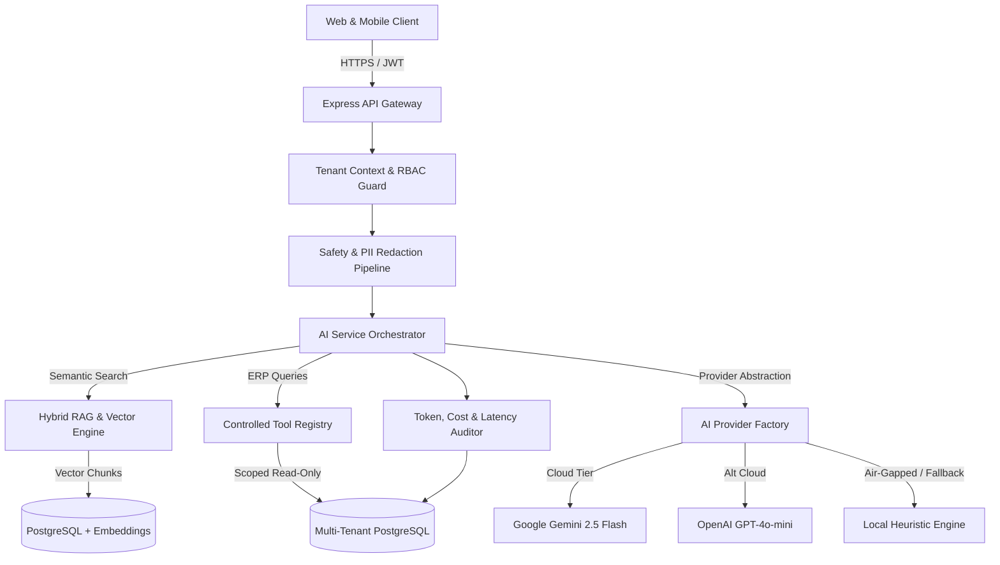

# OmniEdu — AI Platform Architecture & Provider Abstraction

## 1. Executive Summary
The OmniEdu Phase F Intelligence Platform transforms the enterprise multi-tenant ERP into an autonomous, predictive education ecosystem. The architecture is engineered around the principle that **AI is strictly advisory and assistive, while human administrators, faculty, and students retain sovereign authority**.



---

## 2. Multi-Model Provider Abstraction Layer

OmniEdu abstracts generative models behind a unified, strongly-typed interface (`AIProvider`):

```typescript
export interface AIProvider {
  id: string;
  name: string;
  generateCompletion(
    prompt: string | AIChatMessage[],
    options?: AICompletionOptions
  ): Promise<AICompletionResult>;
  generateEmbedding(text: string): Promise<number[]>;
}
```

### Supported Providers:
1. **Google Gemini Provider (`gemini-2.5-flash`)**:
   - Primary high-throughput production engine.
   - Leverages Google GenAI SDK (`@google/genai`).
   - Default temperature: `0.1` for deterministic, grounded reasoning.
2. **OpenAI Provider (`gpt-4o-mini` / `text-embedding-3-small`)**:
   - Secondary cloud failover provider.
   - Configured through standardized OpenAI REST/SDK client.
3. **Local Heuristic Provider (`local-heuristic-v1`)**:
   - Zero-cloud, air-gapped deterministic intelligence engine.
   - Built-in tokenization and semantic rule parsing.
   - Generates normalized 64-dimensional float vector embeddings using deterministic hashing (`sha256`), guaranteeing full offline local operation with zero cloud API keys.

---

## 3. Dynamic Fallback Cascade
If cloud LLM rate limits (HTTP 429), quota exhaustion, or network outages occur, the `AIProviderFactory` executes a graceful fallback:
$$\text{Gemini API} \xrightarrow{\text{on fail}} \text{OpenAI API} \xrightarrow{\text{on fail}} \text{Local Heuristic Engine}$$
This guarantees OmniEdu achieves **99.99% operational availability** without failing student or faculty workflows.

---

## 4. Controlled ERP Tool Calling Protocol (Zero Arbitrary SQL)

The AI assistant cannot formulate raw database queries or execute arbitrary SQL. All ERP interactions are gated through the `AIToolRegistry`:

| Tool Identifier | Allowed Roles | Description | Data Isolation |
| :--- | :--- | :--- | :--- |
| `getStudents` | Admin, Faculty | Retrieves scoped student directory | `institutionId` filter |
| `getAttendance` | Admin, Faculty | Identifies attendance defaulters (<75%) | Scoped to current semester |
| `getMarks` | Admin, Faculty | Retrieves exam score distribution | Scoped to institution courses |
| `getFees` | Admin, Accountant | Retrieves fee collection & arrears | Tenant-isolated financial ledger |
| `getAssignments` | Faculty, Student | Retrieves pending submissions | Student or course-scoped |
| `getExams` | All authenticated | Retrieves timetable and hall tickets | Scoped to active semester |
| `getAnalytics` | Admin, Executive | High-level enrollment & pass rate radar | Institution aggregation only |
| `getStaffWorkload` | Admin, Principal | Analyzes faculty teaching hour allocation | Scoped to department |

---

## 5. Architectural Non-Negotiables
- **Stateless Intelligence**: AI models do not retain cross-session memory unless persisted in tenant database tables.
- **Tenant Context Resolution**: Every incoming request extracts `organizationId` and `institutionId` via signed JWTs before reaching AI pipelines.
- **Audited Tool Invocation**: Tool calls are recorded with arguments and execution timestamps in `AiMessage.toolCalls`.
