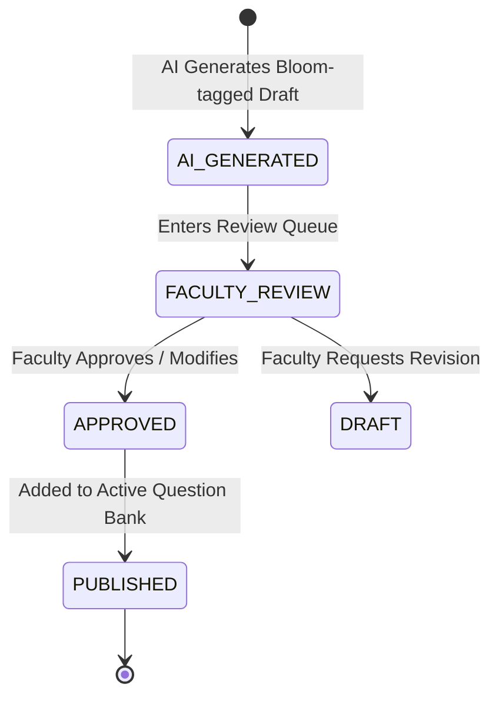

# OmniEdu — AI Governance, Ethics & Human-in-the-Loop Policies

## 1. Core Principles
OmniEdu follows five core governance principles governing artificial intelligence in education:

1. **Human Agency & Ultimate Authority**: No student admission, suspension, financial penalty, or final academic grade can be finalized autonomously by an AI model.
2. **Pedagogical Integrity**: AI generated questions, rubrics, and feedback must align with approved university syllabus frameworks (e.g. Bloom's Taxonomy, NBA/NAAC criteria).
3. **Auditability & Traceability**: Every AI inference, suggested draft, or evaluation is captured with full prompt metadata, model version, and user ID.
4. **Bias Mitigation**: Multi-signal risk engines must not factor socioeconomic background, gender, or religion into dropout vulnerability calculations.
5. **Transparency**: Students and parents have the explicit right to know when feedback or study schedules have been AI-generated.

---

## 2. Human-in-the-Loop (HITL) Lifecycles

### A. Exam Question Lifecycle

### B. Institutional Circulars & Notifications
- AI drafts circulars, warnings, and announcements.
- The flag `requiresHumanApproval: true` is **mandatory** on all generated communications.
- Messages cannot enter dispatch queues (SMS, WhatsApp, Email, In-App) until an authorized administrator or principal signs off.

### C. Assisted Grading
- AI evaluates subjective answers against faculty-configured rubrics.
- Generates `suggestedMarks` and itemized feedback.
- The faculty member reviews the evaluation and confirms `finalMarks`. The database records:
$$\Delta = \text{finalMarks} - \text{suggestedMarks}$$
Any systematic deviation ($\Delta > 15\%$) triggers automated review by the Head of Department.
