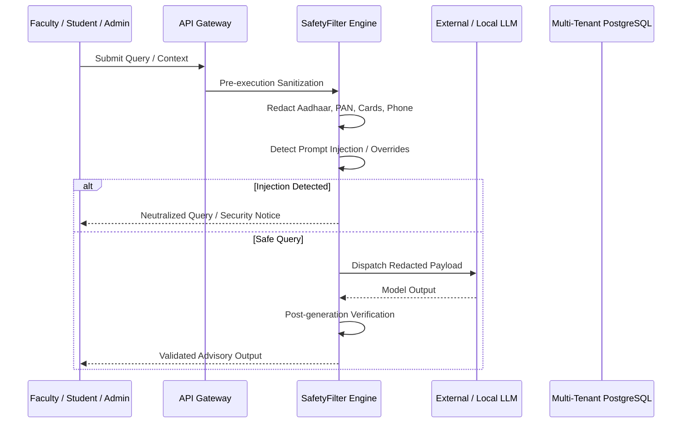

# OmniEdu — AI Security, Privacy & Guardrails Specification

## 1. Zero-Trust Security Architecture for AI Workflows
OmniEdu incorporates defense-in-depth security principles across every interaction with Large Language Models. Under no circumstances is raw student Personally Identifiable Information (PII) transmitted to external LLM endpoints.

---

## 2. PII Redaction Pipeline
The `SafetyFilter` module sanitizes all user prompts, institutional documents, and uploaded content before inference:

| Data Type | Detection Pattern | Redaction Token |
| :--- | :--- | :--- |
| **Aadhaar Number** | `\b\d{4}[ -]?\d{4}[ -]?\d{4}\b` | `[REDACTED_AADHAAR]` |
| **Indian PAN Card** | `\b[A-Z]{5}[0-9]{4}[A-Z]{1}\b` | `[REDACTED_PAN]` |
| **Credit/Debit Card** | `\b(?:\d{4}[ -]?){3}\d{4}\b` | `[REDACTED_PAYMENT_CARD]` |
| **Phone Number (IN)** | `\b(?:\+91[\s-]?)?[6-9]\d{9}\b` | `[REDACTED_IDENTIFIER]` |
| **Email Address** | Standard RFC 5322 regex | `[REDACTED_EMAIL]` |

---

## 3. Prompt Injection Defense & Jailbreak Guardrails
OmniEdu actively detects and neutralizes adversarial prompt injection techniques:
- **System Prompt Overrides**: `ignore previous instructions`, `bypass rules`, `pretend you are an unfiltered assistant`.
- **Delimited Escapes**: Triple backtick fences and markdown delimiter breaking.
- **Role Inversion**: Directives attempting to force model to assume developer or system roles.

When an injection attempt is detected:
1. Malicious directives are stripped and substituted with `[DISALLOWED_PROMPT_INJECTION]`.
2. The security event is flagged with `injectionDetected: true`.
3. The query is logged in tenant security telemetry for administrative audit.

---

## 4. Multi-Tenant Vector Isolation
All vector chunks and knowledge embeddings are bound to `institutionId` and `organizationId`:
$$\text{Filter Clause: } \text{WHERE } c.institutionId = \text{tenantCtx.institutionId}$$
Cross-tenant semantic leakage is mathematically impossible because the vector retrieval query strictly enforces tenant predicates prior to similarity calculation.

---

## 5. Phase F Final QA & Production Hardening Verification

### A. Strict Role-Based Route Gating (`requireRoles`)
All sensitive Phase F routes are gated by server-side role checks:
- `/api/ai/knowledge/upload`: Restricted to `['INSTITUTION_ADMIN', 'HOD', 'FACULTY', 'CLASS_ADVISOR', 'CLASS_TEACHER']`.
- `/api/ai/knowledge/documents/:id` (DELETE): Restricted to `['INSTITUTION_ADMIN', 'HOD']`.
- `/api/ai/risk/evaluate` & `/risk/early-warning`: Restricted to academic staff and faculty.
- `/api/ai/questions/generate` & `/questions/:id/review`: Restricted to academic staff and faculty.
- `/api/ai/usage/analytics`: Restricted to `['INSTITUTION_ADMIN', 'HOD']`.

### B. Student IDOR Defense
In student-facing endpoints (`/learning/recommendations/:studentId`, `/learning/study-plan`, `/career/readiness`), when the authenticated caller holds the `STUDENT` role, the server cross-references the requested `studentId` with the caller's linked student profile. Any attempt to inspect or generate data for another student is rejected with `403 Forbidden`.

### C. Untrusted Context & Indirect Injection Neutralization
Knowledge base documents and external syllabus files are treated as untrusted input. Before ingestion into prompts, `SafetyFilter.sanitizeDocumentContext` strips `<system>`, `<<SYS>>`, `[INST]`, and injection delimiters, neutralizing indirect prompt injection embedded within uploaded documents.

### D. PII Pipeline Execution Ordering
Credit card redaction (13–16 digits) executes prior to Aadhaar redaction (12 digits), ensuring 16-digit card numbers are never incorrectly truncated or partially matched by Aadhaar filters.

### E. Resilient Provider Failover Cascade
`AIProviderFactory` implements `ResilientFallbackProvider`, ensuring that if upstream cloud providers (Google Gemini, OpenAI) experience rate limits, quota exhaustion, or 5xx outages, the system automatically falls back to secondary providers and the deterministic `LocalHeuristicProvider` without service interruption or application crashes.
