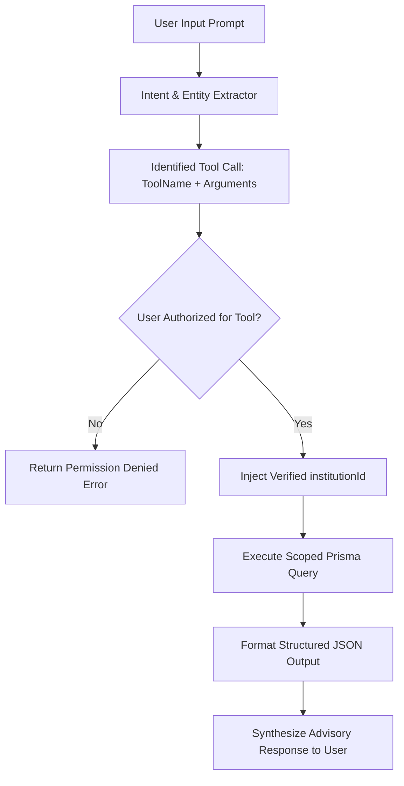

# OmniEdu — Controlled ERP Tooling & Schema Contracts

## 1. Tool Execution Protocol
All tool calls requested by the AI orchestrator must strictly conform to JSON Schema parameters and require explicit tenant context resolution.

---

## 2. Tool Registry Specifications

### `getStudents`
- **Purpose**: Retrieve student roster filtered by department, batch, or status.
- **Parameters**:
  - `limit` (integer, optional, default: 10)
  - `departmentId` (string, optional)
- **Constraint**: Scoped strictly to `institutionId`.

### `getAttendance`
- **Purpose**: Identify students falling below a specified attendance threshold.
- **Parameters**:
  - `belowThreshold` (number, default: 75.0)
- **Returns**: Defaulter list with percentage, missed hours, and parent contact information.

### `getMarks`
- **Purpose**: Exam performance and course grade statistics.
- **Parameters**:
  - `courseId` (string, optional)
  - `examId` (string, optional)
- **Returns**: Average marks, pass rate percentage, and low scoring outliers.

### `getFees`
- **Purpose**: Financial standing, delinquent accounts, and pending fee structures.
- **Parameters**:
  - `status` (string, optional: `PENDING` | `OVERDUE` | `PAID`)
- **Returns**: Aggregate collected, outstanding receivables, and high-balance student alerts.

### `getStaffWorkload`
- **Purpose**: Teaching hour allocation across departmental faculty.
- **Parameters**:
  - `departmentId` (string, optional)
- **Returns**: Total course offerings assigned, weekly lecture hours, and overload status.

---

## 3. Tool Authorization Matrix & Adversarial Hardening

### Server-Side Role Enforcement (`TOOL_ALLOWED_ROLES`)
Each tool checks caller roles on the server before execution:
- `getStudents`: `['PLATFORM_ADMIN', 'ORG_ADMIN', 'INSTITUTION_ADMIN', 'HOD', 'FACULTY', 'CLASS_TEACHER', 'CLASS_ADVISOR']`
- `getAttendance`: `['PLATFORM_ADMIN', 'ORG_ADMIN', 'INSTITUTION_ADMIN', 'HOD', 'FACULTY', 'CLASS_TEACHER', 'CLASS_ADVISOR', 'STUDENT']` (Students restricted to their own attendance)
- `getMarks`: Staff roles and self-scoped Student
- `getFees`: Administrative roles and self-scoped Student/Parent
- `getAnalytics`: `['PLATFORM_ADMIN', 'ORG_ADMIN', 'INSTITUTION_ADMIN', 'HOD']`
- `getStaffWorkload`: `['PLATFORM_ADMIN', 'ORG_ADMIN', 'INSTITUTION_ADMIN', 'HOD']`

### Adversarial Input Defenses:
- **No Dynamic SQL**: The model never generates raw SQL. Queries are strictly executed via hardcoded Prisma parameters.
- **Unknown Tool Rejection**: Any tool not registered in `TOOL_ALLOWED_ROLES` throws `400 AppError('Unknown ERP tool')`.
- **Parameter Bounds**: Limits on query counts (e.g., maximum 50 records) prevent data dumping.
- **Multi-Tenant Injection Protection**: The tool engine ignores any tenant ID provided in user prompt or tool parameters, binding execution solely to the validated `ctx.institutionId`.
