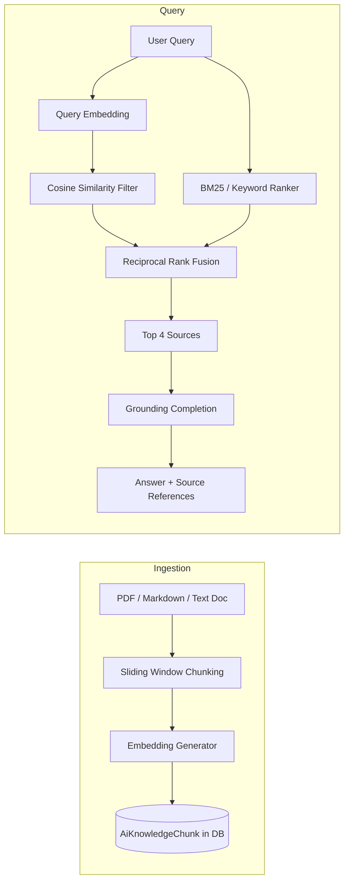

# OmniEdu — Institutional RAG & Hybrid Vector Retrieval Architecture

## 1. Overview
The Institutional Retrieval-Augmented Generation (RAG) subsystem enables students, faculty, and academic deans to query institutional handbooks, syllabus regulations, attendance policies, and fee structures with verified citations and zero hallucination.

---

## 2. Ingestion & Chunking Strategy
Document processing adheres to strict pedagogical boundary rules:
- **Chunk Size**: 500 characters (optimal for regulatory clauses and policy articles).
- **Chunk Overlap**: 80 characters (preserves sentence continuity and semantic cross-references).
- **Metadata Tagging**: Each chunk stores `documentId`, `institutionId`, `chunkIndex`, `documentType`, `academicYear`, and `visibility`.

---

## 3. Mathematical Vector Similarity Engine
Embeddings are represented as normalized unit vectors $\vec{u}, \vec{v} \in \mathbb{R}^d$.

Cosine similarity is computed as:
$$\text{Sim}(\vec{u}, \vec{v}) = \frac{\vec{u} \cdot \vec{v}}{\|\vec{u}\|_2 \|\vec{v}\|_2} = \sum_{i=1}^d u_i v_i$$

Hybrid scoring merges vector similarity with lexical term matching:
$$\text{FinalScore} = 0.70 \times \text{CosineSimilarity} + 0.30 \times \text{LexicalMatchScore}$$

### Similarity Calibration:
- **Score $\ge 0.75$**: High confidence institutional match. Direct excerpt cited.
- **Score $0.40 - 0.74$**: Moderate confidence match.
- **Score $< 0.40$**: Below grounding threshold. The system responds with:
  *"The requested policy or academic information could not be verified in the institutional knowledge base."*

---

## 4. Visibility Control & Authorization
Knowledge documents inherit RBAC visibility tags:
- `ALL`: Public to students, faculty, and administrators.
- `FACULTY_ONLY`: Internal grading guidelines, meeting minutes, lesson plans.
- `ADMIN_ONLY`: Salary scales, compliance audits, financial resolutions.
- `PARENTS_AND_STUDENTS`: General code of conduct, exam calendar, transportation policies.

Retrieval strictly excludes documents where the querying user lacks sufficient access rights.
