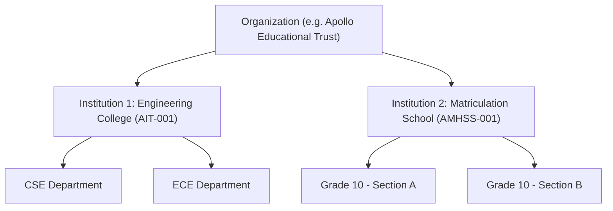

# OmniEdu — Multi-Tenant Security & Access Control Architecture

## 1. Multi-Tenancy Hierarchy
OmniEdu models educational conglomerates through a two-tiered tenancy model:
1. **Organization Tier**: The overarching educational trust or foundation (e.g., `Apollo Educational Trust`). Manages cross-institutional billing, subscription tiers, and global administrators (`ORG_ADMIN`).
2. **Institution Tier**: Autonomous operating campuses (e.g., `Apollo Institute of Technology` [College] and `Apollo Matriculation Higher Secondary School` [School]). Manages localized departments, courses, students, faculty, and academic records.



## 2. Tenant Context Resolution (`tenantContext.ts`)
Tenant resolution occurs automatically during HTTP request execution through the following pipeline:
1. **Header Identification**: The client provides `x-institution-id` (or `x-organization-id`).
2. **Membership Verification**: The user's authenticated session is verified against `InstitutionMembership` in PostgreSQL.
3. **Context Injection**: `req.tenantContext` is populated containing:
   - `organizationId`: ID of the tenant organization.
   - `institutionId`: ID of the active campus institution.
   - `userId`: ID of the active user.
   - `role`: Role assigned to the user within this specific institution.
   - `departmentId`: Department scope (if HOD/Faculty).
   - `academicScope`: `COLLEGE` or `SCHOOL` ruleset flag.

## 3. Database Isolation Enforcement (`tenantQuery.ts`)
To prevent IDOR (Insecure Direct Object Reference) and cross-tenant leakage:
- **Zero Ambiguous Queries**: Queries for operational entities are wrapped in `withTenantContext(ctx)`:
  ```typescript
  export function withTenantContext<T extends Record<string, any>>(
    ctx: TenantContext,
    where: T = {} as T
  ): T & { institutionId: string } {
    if (!ctx.institutionId) {
      throw new AppError('Tenant isolation error: No active institution context provided', 400);
    }
    return {
      ...where,
      institutionId: ctx.institutionId,
    };
  }
  ```
- **Scope Verification (`assertEntityScope`)**: When updating or deleting an entity by primary key, the service verifies that the entity's `institutionId` strictly matches `ctx.institutionId`. Cross-tenant manipulation yields a `403 Forbidden` response.

## 4. Server-Side RBAC & Permission Matrix
OmniEdu enforces fine-grained permissions via `Permission` enum and `RolePermission` junction tables:
- **System Admin (`SYSTEM_ADMIN`)**: Unrestricted platform superuser.
- **Organization Admin (`ORG_ADMIN`)**: Manages institutions, plans, billing, and global user provisioning across all campuses in the trust.
- **Institution Admin / Principal (`INSTITUTION_ADMIN`)**: Autonomous campus administration, fee assignments, timetable publishing, and faculty assignments.
- **Head of Department (`HOD`)**: Departmental course management, mark approvals, and faculty schedules. Cannot view or alter data outside their assigned department.
- **Faculty / Teacher (`FACULTY`, `CLASS_TEACHER`)**: Mark entry, attendance taking, assignment grading.
- **Student / Parent (`STUDENT`, `PARENT`)**: Read-only ledger, personal mark-sheets, attendance, homework. Scoped strictly to own student ID or linked wards.
- **Custom Dynamic Roles**: Stored in `Role` table with custom permission arrays, dynamically evaluated in middleware.

## 5. Session Hardening & Refresh Token Rotation
- **Dual JWT Architecture**:
  - `Access Token`: Signed with `JWT_SECRET`, 15-minute expiration, stateless validation. Contains user ID, active institution, and roles.
  - `Refresh Token`: Signed with `JWT_REFRESH_SECRET`, 7-day expiration. Includes a unique cryptographic UUID nonce (`jti`).
- **Database Nonce Tracking**: Refresh tokens are hashed via SHA-256 and recorded in `RefreshTokenRecord`.
- **Replay Attack Detection**: If a revoked or already-used refresh token is presented, the server detects token theft and invalidates **all** active refresh tokens for that user session, forcing full re-authentication.
