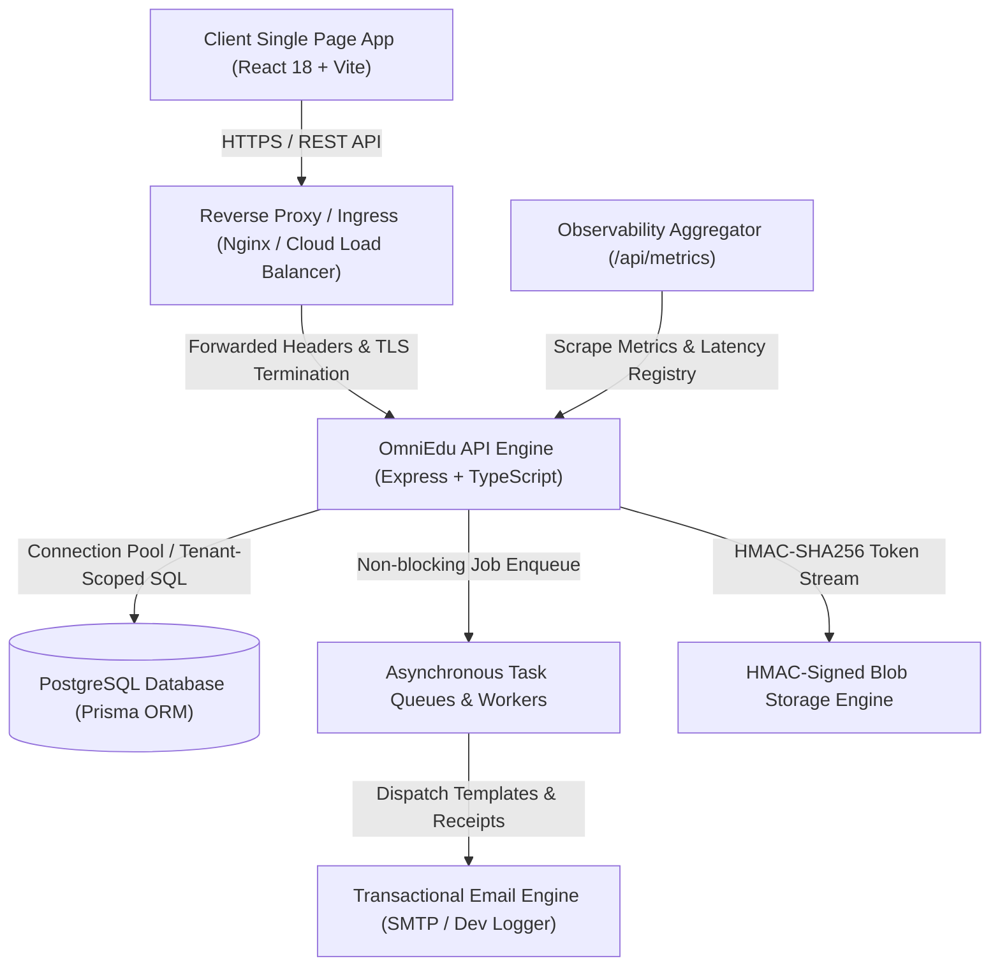

# OmniEdu — System Architecture & Component Design

## 1. Architectural Overview
OmniEdu is an enterprise-grade, multi-tenant Educational Resource Planning (ERP) platform architected for colleges, schools, and educational trusts. It uses a decoupled client-server architecture with strict tenant isolation, asynchronous background task queues, and cryptographic security protocols.

## 2. Core Subsystems

### 2.1 Web Application Tier (`client/`)
- **Technology**: React 18, Vite 5, Tailwind CSS, Lucide Icons, html2canvas, jsPDF.
- **Routing & State**: React Router v6 with dynamic code-splitting via `React.lazy` and `Suspense`. Every heavy view (Analytics, Defaulters Radar, Marks Ledger, Exam Coordinator, Curriculum Designer, Reports Hub) is isolated into separate on-demand chunks.
- **Bundle Metrics**: Core application entry point reduced to **464 kB** (148 kB gzipped), meeting production Core Web Vitals thresholds.
- **Offline / Degraded Detection**: Built-in Network Health listener alerting users upon connectivity loss and caching session tokens.

### 2.2 Application Server Tier (`server/`)
- **Technology**: Node.js 20 LTS, Express 4, TypeScript 5.
- **Configuration & Validation**: Environment variables loaded and strictly validated at boot time via Zod (`src/config/env.ts`), aborting startup on missing keys.
- **Security Middleware Chain**:
  - `helmet`: Strict Content Security Policy (CSP), Frameguard (`DENY`), HSTS (`max-age=31536000`), X-Content-Type-Options (`nosniff`), Referrer-Policy (`strict-origin-when-cross-origin`).
  - `cors`: Dynamic origin whitelisting supporting staging, production, and localhost origins.
  - `express-rate-limit`: Multi-tiered rate limiters protecting public login endpoints (10 req/15m) and general API routes (300 req/15m).
  - `requestTracing`: Auto-assigns or propagates `X-Request-Id` UUID, records response duration, and updates the prometheus metrics registry.

### 2.3 Persistence Tier (`PostgreSQL + Prisma`)
- **Multi-Tenant Schema**: Centralized `Organization` and `Institution` hierarchies with mandatory tenant foreign keys on all operational models (`Student`, `Attendance`, `Course`, `MarkRecord`, `FeeStructure`, `StudentFeeAssignment`, etc.).
- **Optimized Composite Indexes**:
  - `Attendance`: `[institutionId, date]`, `[institutionId, courseId, date]`, `[institutionId, studentId, date]`
  - `MarkRecord`: `[institutionId, examId, courseId]`, `[institutionId, studentId]`
  - `Notification`: `[institutionId, userId, isRead]`
  - `AuditLog`: `[institutionId, createdAt]`, `[organizationId, createdAt]`
- **Session Tokens**: `RefreshTokenRecord` table storing SHA-256 hashed refresh tokens with unique cryptographically random `jti` nonces to detect token replay/reuse attacks.

### 2.4 Asynchronous Worker Subsystem (`server/src/services/queue`)
- In-memory asynchronous queue manager supporting up to 5 concurrent workers, exponential backoff retries (3 attempts), failure dead-letter state tracking, and job lifecycle events.
- Dispatches transactional emails, PDF generation jobs, and notification fan-outs without blocking the HTTP request/response thread.

### 2.5 Storage Subsystem (`server/src/services/storage`)
- Secure asset streaming engine serving student photos, mark-sheets, and identity cards.
- Signed URLs generated via HMAC-SHA256 tokens valid for configurable expiry windows (default 3600 seconds) preventing unauthorized direct object access.
