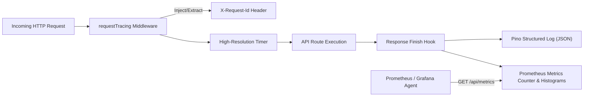

# OmniEdu — Observability, Metrics & Monitoring Guide

## 1. Observability Architecture
OmniEdu provides enterprise-grade observability through three synchronized pillars:
1. **Structured JSON Logging** (`Pino`)
2. **End-to-End Request Tracing** (`X-Request-Id`)
3. **Prometheus-Compatible Metrics** (`/api/metrics`)



## 2. Structured JSON Logging (`Pino`)
All log messages output machine-parsable JSON with consistent contextual metadata:
```json
{
  "level": "info",
  "time": "2026-09-10T14:55:27.123Z",
  "pid": 5538,
  "hostname": "prod-node-01",
  "service": "omniedu-api",
  "env": "production",
  "requestId": "258266c3-06c1-470c-9834-4cce63787a49",
  "method": "GET",
  "path": "/api/students",
  "statusCode": 200,
  "durationMs": 28,
  "institutionId": "7bbb003b-3650-494f-984f-6ba88714351a",
  "userId": "a7d1f555-adac-47ca-9f61-9ac728656b48",
  "ip": "::ffff:127.0.0.1",
  "msg": "Request Handled"
}
```

## 3. Distributed Request Tracing
- Clients may transmit a custom header `X-Request-Id`. If missing, the server automatically assigns a cryptographically unique `crypto.randomUUID()`.
- The `X-Request-Id` is bound to the async request scope and echoed back in the HTTP response headers.
- All database queries, worker jobs, and warning/error entries triggered by the request inherit this `requestId` for instant root-cause analysis in centralized log viewers (Datadog, Loki, CloudWatch).

## 4. Health Probes
OmniEdu provides Kubernetes-compliant readiness and liveness probes:
- **Liveness Probe**: `GET /api/health/live`
  - Returns `200 OK` with process uptime and memory metrics.
- **Readiness Probe**: `GET /api/health/ready`
  - Executes a live `SELECT 1` ping against PostgreSQL. If the database connection is severed, returns `503 Service Unavailable`.

## 5. Metrics Engine (`/api/metrics`)
A Prometheus-compatible metrics endpoint is exposed at `GET /api/metrics`:
- `http_requests_total{method="...", status="..."}`: Cumulative request count by HTTP verb and status code.
- `http_request_duration_ms_avg`: Running average latency per endpoint.
- `http_request_duration_ms_p95`: 95th percentile latency tracker.
- `active_requests`: Current in-flight HTTP connections.
- `process_uptime_seconds`: Node.js runtime uptime.
- `process_memory_heap_used_bytes`: Memory consumption.
