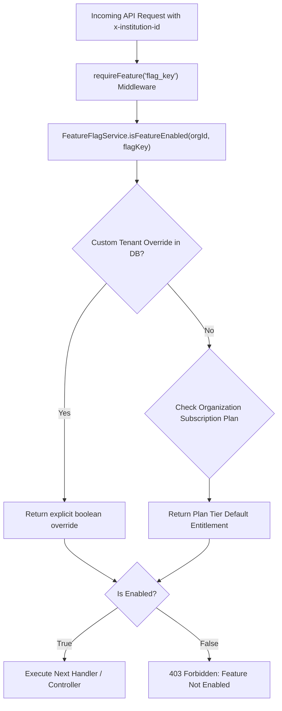

# OmniEdu — Dynamic Feature Flags & Tenant Limit Guards

## 1. Feature Flag Architecture
Feature flags enable seamless feature rollouts, tenant-level entitlements, and conditional capability enablement without requiring codebase redeployments.



## 2. Core Feature Keys
- `advanced_analytics`: Unlocks executive performance radars and predictive attendance defaulter modeling.
- `ai_insights`: Unlocks generative AI student performance summaries and study recommendations.
- `email_alerts`: Enables real-time transactional email delivery for attendance warnings and fee receipts.
- `hall_ticket_qr`: Enables cryptographically signed QR code tokens on examination admission tickets.
- `custom_roles`: Enables organizational creation of dynamic custom RBAC roles.

## 3. Middleware Usage (`requireFeature`)
Endpoints can be gated using the declarative `requireFeature` middleware:
```typescript
import { requireFeature } from '../../middleware/tenantLimitsGuard';

router.get('/predictive-radar', requireFeature('advanced_analytics'), analyticsController.getRadar);
```

## 4. Tenant Feature Flag Management APIs
- `GET /api/saas/features`: List all feature states for the active organization.
- `POST /api/saas/features/:key`: Toggle or set specific feature override (`enabled: true | false`) for a tenant.
